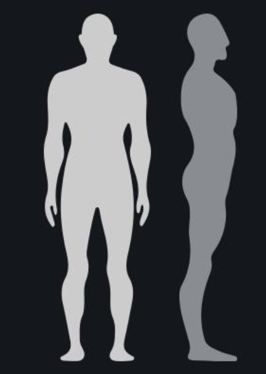

# 3-6-2024

## 数据集清洗

目前采用通用骨架来进行实验，假设人体初始姿态为A型。



### 数据预处理

结合先验知识来初始化各个关节的3D位置坐标。

采集的数据主要为各个IMU关节的旋转矩阵（*Rotation Matrix*）。

设置髋（Hip）关节为Root节点，作为基坐标系，可以使用正向运动学来根据旋转矩阵及初始连杆（骨架）信息获取各个关节的3维相对位置坐标。

加速度信息尚未使用到，目前使用17个IMU对应的节点，共51维特征。

### 数据又采集

为了增强数据的真实性和复杂性，我们在原有引体向上数据的基础上，额外采集了其他的运行数据，包括：1. 行走；2. 站立；3. 静坐 4. 双臂向前平举 5. 单臂向上举起 6. 高抬腿

现在样本量为1150个，总时间序列长度为86250。

## 实验设计

### SOTA算法实验

我们使用现有的sota算法-SiMLPe作为基线模型展开数据有效性验证。测试当前收集的数据能否使模型收敛。

我们首先进行人体动作的预测任务，即输入2秒钟（50帧）的数据，输出1秒钟（25帧）的数据。

正如其名，SiMLPe是一个非常简单的纯MLP模型，它结合DCT变换将原始的时间序列进行域变换，在新域内进行模型训练。其骨干模型设计仅采用线性层（Linear，又称全连接层Full Connection）和层归一化（Layer Normalization），具体来说，在输入后先进行空间维度的特征提取，后经过多层残差设计的模块，进行时间维度的特征提取，并将序列长度转化为输出长度，最后再经过一层全连接层进行进行空间维度提取后输出。

```
Epoch [900/1000], Train Loss: 0.0033, Val Loss: 0.0062
Epoch [910/1000], Train Loss: 0.0031, Val Loss: 0.0069
Epoch [920/1000], Train Loss: 0.0030, Val Loss: 0.0072
Epoch [930/1000], Train Loss: 0.0030, Val Loss: 0.0064
Epoch [940/1000], Train Loss: 0.0031, Val Loss: 0.0065
Epoch [950/1000], Train Loss: 0.0027, Val Loss: 0.0070
Epoch [960/1000], Train Loss: 0.0033, Val Loss: 0.0078
Epoch [970/1000], Train Loss: 0.0029, Val Loss: 0.0067
Epoch [980/1000], Train Loss: 0.0029, Val Loss: 0.0064
Epoch [990/1000], Train Loss: 0.0029, Val Loss: 0.0068
Epoch [1000/1000], Train Loss: 0.0030, Val Loss: 0.0071
```

上表为SiMLPe迭代1000次后收敛情况，单位为毫米（mm），最小测试误差约为6mm。

### 模型架构改进

考虑到不同的人体动作可能只与部分关节有关，例如引体向上只有身体上半部分的关节在“发挥作用”。而MLP对所有的特征“一视同仁”，这会造成一定的维度灾难。为了缓解这个问题，我尝试在SiMLPe中添加注意力机制，使模型只关注部分关节特征，以达到近似降维的效果。

我测试了多种不同的注意力头，并多次调整超参数，得到结果如下表所示：

| Model                        | Val Loss |
| ---------------------------- |----------|
| SiMLPe                       | 2.52     |
| Dual-end Attention           | 19.3     |
| Scaled Dot-Product Attention | 4.75     |
| Single-Head Attention        | 2.38     |
| **Multi-Head Attention**     | **2.07** |

经过多次实验，当注意力层添加至最后一个空间特征提取层前时的效果最好，这可能是因为在经过时序特征提取后，注意力机制能够发现当前序列中对模型预测贡献较大的关节特征，并强化这些特征权重，从而得以提升性能。

而仅仅使用多头注意力（自注意力）的作用最好，自注意力机制能够发现特征间的关系。因为各个关节间存在动力学关系，所以添加自注意力机制能够更好地发掘关节间的物理关联，以更好地赋予特征权重。

## 数据挖掘

下一步准备进行重建任务，根据序列来进行3D可视化。

